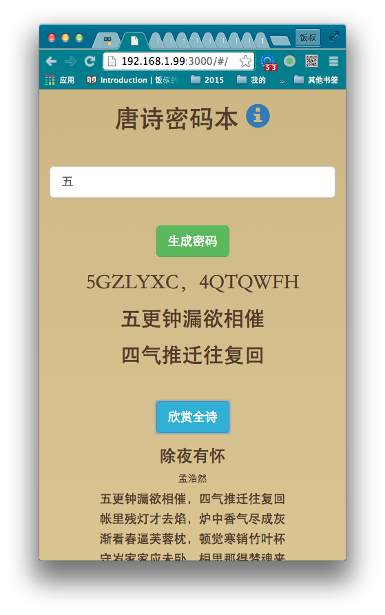

# 唐诗密码本

### 演示
http://mima.treenote.net/  
手机扫码打开  

### 怎么使用?

如果你不知道怎么编一个复杂的密码,那么随机生成一个. 比如"SDSGB9H". 可是这是个什么鬼怎么记?! 来,背一句唐诗就好了. "上帝深宫闭九阍". 拼音首字就是. 而且有数字的哦. 密码级别很高的. 如果有天忘了,凭模糊的印象去翻李商隐的诗集. 或许能找出来的.

###灵感词怎么用?

如果你输入了灵感词,密码句子里会尽量包含这个词.但是不保证有. 比如你希望给自己的工商银行账号起密码,但是又怕不好记.可以以"工商"为灵感词.生成"GSCWQ，NMDSB" (工商彻屋去,牛马登山避)(大水-白居易). 如果希望有数字3.可以用"三"做灵感词,得到如"MJZWWXY，XZ3ZBYR"(盟经早晚闻仙语,学种三芝伴羽人)这样的密码.

### 一句

觉得这个有意思的同学可以去看看[一句](http://one.treenote.net),受这个启发而产生的阅读应用. 

### 开源项目

这是一个开源项目, <https://github.com/fangj/mima>, 用 express,angular 搭建. 欢迎小伙伴到 github 上点小星星.

### 开发者

    npm install
    npm start
    访问 http://localhost:3000

### 感谢

本项目使用了这些小伙伴的贡献:

* <https://github.com/hxgdzyuyi/tang_poetry>
* <https://github.com/hotoo/pinyin>

### 更多说明  

* 一个常见问题是,如果很多人用了唐诗密码本,是不是会撞密码,不安全?

答案:是也不是.

是:如果您直接用密码本生成的密码
不是:如果您掌握使用密码本的正确姿势

* 什么是使用密码本的正确姿势

您要往机器生成的里面掺沙子.加入自己个性的改变.

* 如果既然要用户费脑子想沙子还要密码本有什么用？     

沙子本身可以安全性很差，可能只有 1~2 位，可能用户长期都用一样的沙子。     
real_password= pesdo_password (机器生成的)+simple_password （用户生成的）     

沙子本身可能只是一个变幻规则，要作用到一个字符串上才能成为实体密码     
real_password=userTransfer (pesdo_password )     

沙子对用户本人是好记的。有较弱的安全度。     

伪密码对知道明文的所有人是好记的。有一般的安全度。     

伪密码+沙子=只对用户本人是好记的。有较强的安全度。     

* 唐诗密码本试图解决的是什么问题?

在人类可以用大脑记住的密码里,尽量提高复杂度.

为什么?

我们完全可以用机器生成随机度很高的高强度密码, 比如"F#Beq3qH6&@xO3X4".但是很难记住.
如果密码不能被记住,那么有2种后果.
1. 你根本不用那样的密码,还是选择好记的生日或者123之类的密码. 
2. 你使用了高强度密码,但是把它记录在某个地方.那么你的安全性就决定于"某个地方".如果"某个地方"是个本子,那么安全性就依赖那个本子. 如果"某个地方"是邮箱网盘电子笔记,那么安全性就依赖那个提供邮箱网盘电子笔记的厂商. 同时还有个问题是如果你还有可能忘了密码记在哪.

密码本的目的，是寻找一个『好记』和『强度』的平衡。

人类密码=好记+随机性     
密码本提供的是=好记+伪随机     
    
最终密码 = 程序建议密码（好记+伪随机）+ 用户个性规则（用户个人方便记忆+更强的随机）(所谓的沙子)     

这样的排列组合对原字典扩大很多种可能，同时，因为『沙子』不在程序里，所以更加安全。     

沙子用户自己掺有 2 个好处：     
1. 自己想出来的沙子自己能记住     
2. 沙子在用户脑子里：安全     

http://www.360doc.com/content/10/0520/16/114824_28577582.shtml、、    

### 如何掺沙子    

演示下如何掺沙子。 为了方便理解。不用英文了。中文请脑补为拼音。     
伪随机母密码：『两个黄鹂鸣翠柳』     
=>     
黄鹂鸣翠柳        
2 个黄鹂鸣翠柳        
两个黄鹂鸣:翠柳        
两个 /黄鹂 /鸣翠柳        
2 个 /黄鹂 /鸣:翠柳        
2 个 /y 鹂:鸣翠柳 (注： y 是 yellow 的意思）        
2 个 /y 鹂,鸣:gt (注： gt 是 green tree 的意思）        
2bmgt (注： two birds 鸣 green tree )        
两个黄鹂在 V2EX 鸣翠柳        

采用唐诗的意义在于，由于母密码是有语言含义的，用户可以做很多变幻，又不丧失可记忆性。     
唐诗密码本采用的是全唐诗，字数是唐诗300首的 140 多倍。     
加上类似上面的 特殊符号断句，数字化，英文化，减字, 增字 等多种变幻手法排列组合,一个母密码可以变幻上千倍。     
上千倍怎么算:你只要往里面加2个数字/字母. 那么排列组合是36*36=1296. 也就是把母密码的变化扩大了1296倍.
    

### 关于我

饭叔,湖建血统的南京土著. 养着一只肥白的中华田园猫. 有很多有趣的想法,就是没空做T T. 